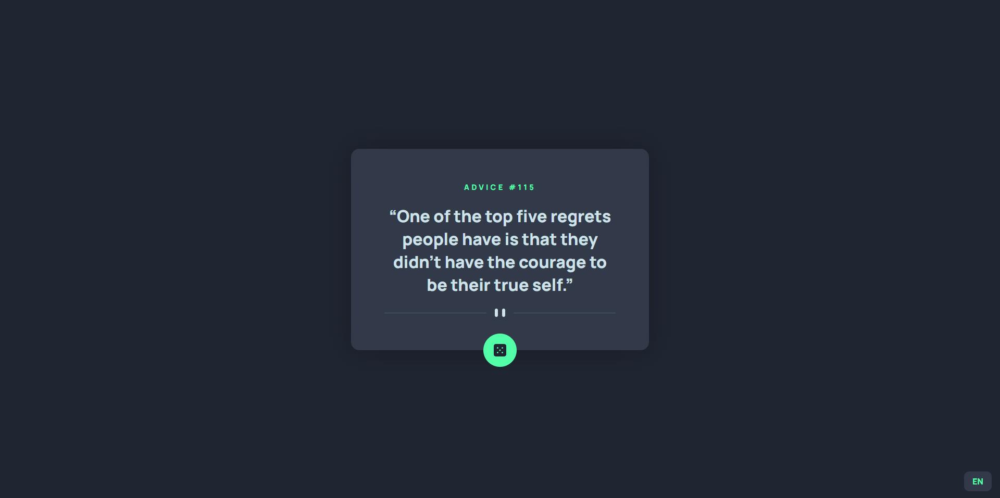

# Frontend Mentor - Advice generator app solution

This is my solution to the [Advice generator app challenge on Frontend Mentor](https://www.frontendmentor.io/challenges/advice-generator-app-QdUG-13db). It has some extra features not described at the challenge, those are page translation to spanish and advice generation cooldown (this one because the API returns the same advice in less than 2 seconds).

Spanish advice take a little bit longer to load since i use another API to translate right on time the advice provided for the advice API

## Installation

1. Clone this repo

```
git clone https://github.com/johansantana/vue-advice-generator.git
```

2. Install dependencies

```
cd vue-advice-generator
npm install
```

3. Run local development server

```
npm run dev
```

## Overview

### The challenge

Users should be able to:

- View the optimal layout for the app depending on their device's screen size
- See hover states for all interactive elements on the page
- Generate a new piece of advice by clicking the dice icon
- Switch between ES/EN languages

<hr />

### Screenshot



### Live Demo

[https://johansantana.github.io/vue-advice-generator/](https://johansantana.github.io/vue-advice-generator/)

<hr />

### Built with

| VueJS                      |
| -------------------------- |
|  |

#### APIs

- [Advice Slip JSON API](https://api.adviceslip.com/)
- [Microsoft Translator Text](https://rapidapi.com/microsoft-azure-org-microsoft-cognitive-services/api/microsoft-translator-text/)
